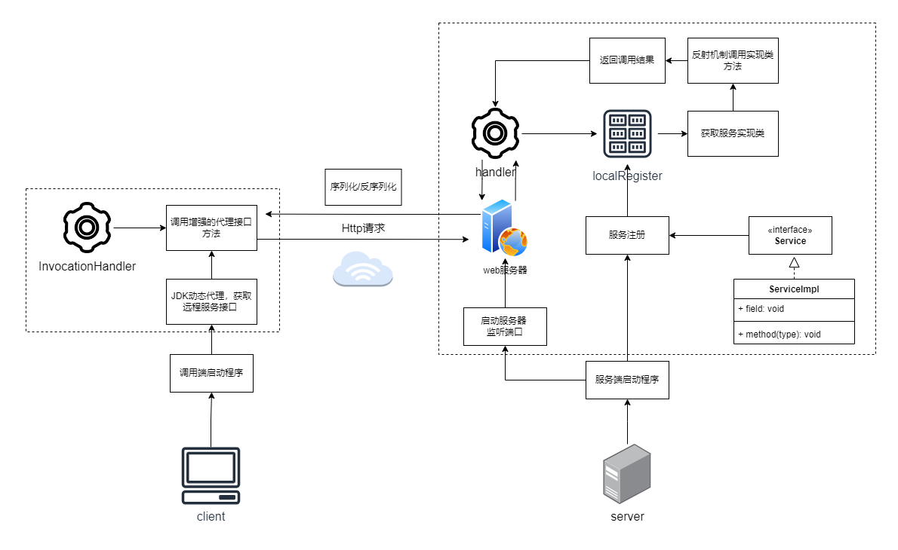
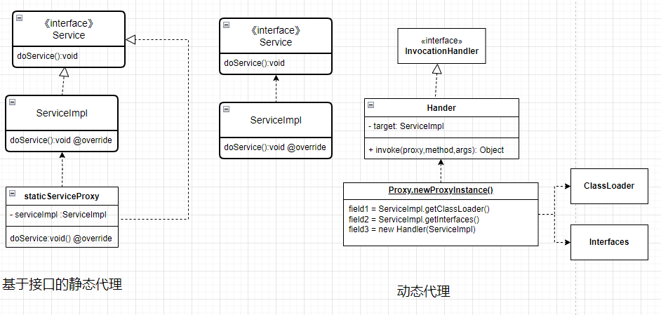

# rpc-framework
## 架构原理



## 项目结构
该RPC框架包含四个主要模块：`common`、`consumer`、`provider` 和 `core`。每个模块的作用如下：
- **common**：定义公共的接口和实体，供 `provider` 和 `consumer` 使用。
- **provider**：服务提供方，包含服务的具体实现。
- **consumer**：服务调用方，发送请求并获取服务响应。
- **core**：核心模块，处理RPC的底层逻辑。

## 使用方式
### 1. 定义传输实体和服务接口

在 `common` 模块中，定义服务接口和传输实体。

- **接口参数实体**
  在 `common/src/main/java/com/lambert/rpc/common/model` 中声明实体类。
- **接口**
  在 `common/src/main/java/com/lambert/rpc/common/service` 中声明服务接口类。
### 2. 实现服务逻辑
  在 `provider/src/main/java/com/lambert/rpc/provider/serviceImpl` 中实现服务接口。
### 3. 修改启动类
```java
/**
 * 服务提供方
 */
public class ProviderApplication {
  public static void main(String[] args) {
    // 注册服务
    // Service和ServiceImpl修改为具体实现
    LocalRegistry.register(Service.class.getName(), ServiceImpl.class);

    // 调用core 启动并监听端口
    VertxHttpServer httpServer = new VertxHttpServer();
    httpServer.doStart(8080);
  }
}

```

```java
public class ConsumerApplication {
    public static void main(String[] args) {
        // 根据动态代理工厂获取代理类
        Service proxyService = ServiceProxyFactory.getProxy(Service.class);
        
        // 调用远程服务
        ParamDo paramDo = new ParamDo("data");
        Object result = proxyService.service(paramDo);
    }
}
```
### 4. 运行项目
- 首先，启动服务端程序 `ProviderApplication `来注册并启动服务。
- 然后，启动客户端程序 `ConsumerApplication `来远程调用服务并输出结果。